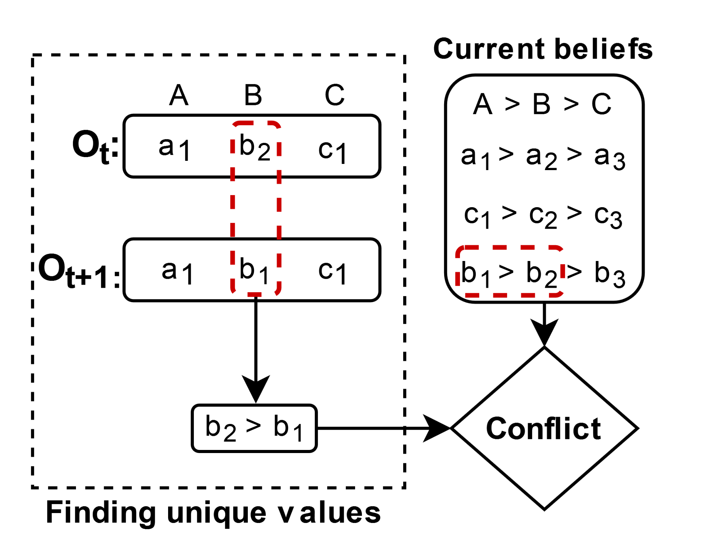
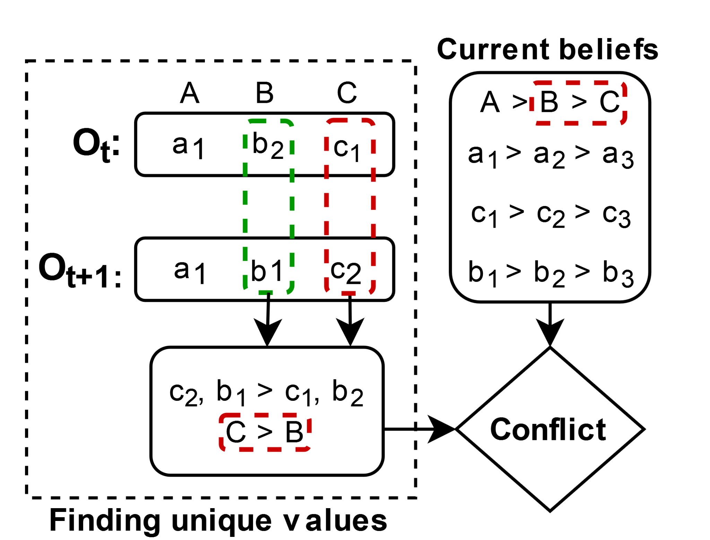
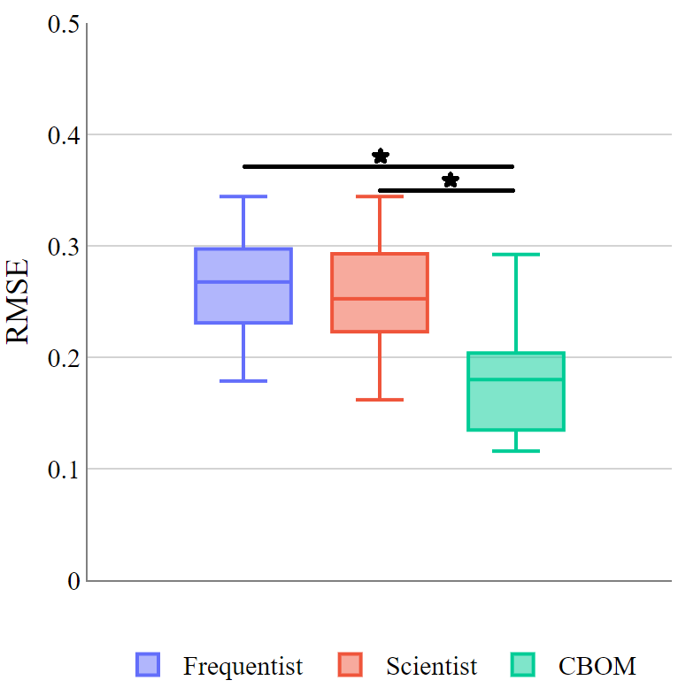
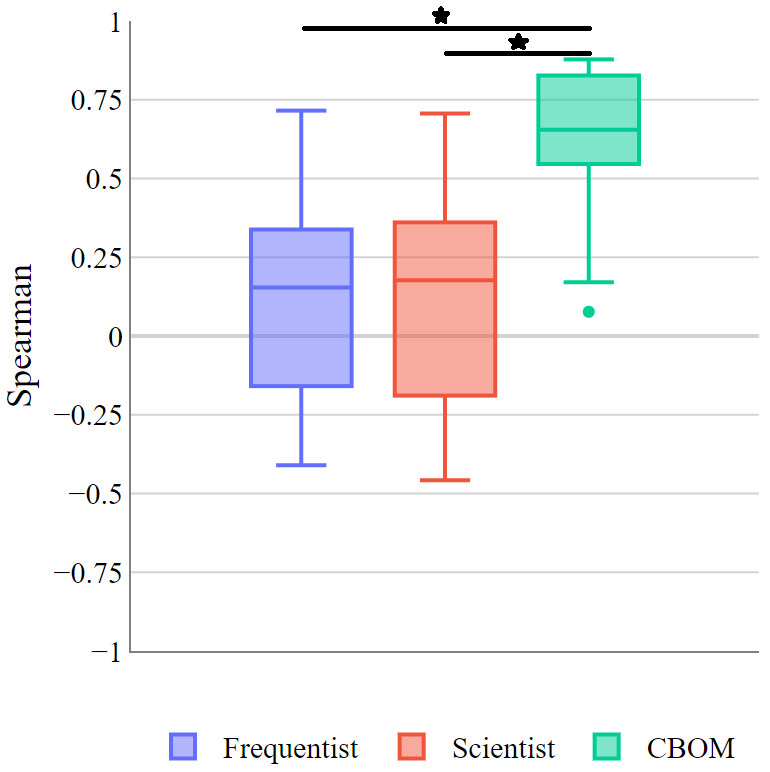

# Conflict-Based Negotiation Strategy for Human-Agent Negotiation — [Applied Intelligence 2023]

Learn an opponent's preferences from their offers, then use those estimates to
choose negotiation offers that balance both parties' interests.

Maintained Python and Java code for **[Conflict-Based Negotiation Strategy for Human-Agent
Negotiation](https://doi.org/10.1007/s10489-023-05001-9)** — Mehmet Onur Keskin,
Berk Buzcu and Reyhan Aydoğan, *Applied Intelligence* (2023).

[](https://github.com/monurkeskin/Conflict-Based-Negotiation-Strategy-Appl-Intell-2023/actions/workflows/tests.yml)
[](https://www.python.org/)
[](LICENSE)
[](https://doi.org/10.1007/s10489-023-05001-9)

[Quick start](#run-your-first-negotiation) · [Usage guide](docs/usage.md) ·
[Java](#run-the-java-agent) · [NegoLog integration](docs/negolog.md) ·
[How it works](docs/method.md) · [Performance](docs/performance.md) ·
[Cite the paper](#cite-the-paper)

People rarely reveal their complete preferences during a negotiation. Their
offers provide clues, but a frequency count can miss the trade-offs between
issues. **CBOM learns a preference ordering by looking for conflicts between
its current beliefs and the offers it observes.** The negotiation strategy
then uses that model to choose among offers it finds acceptable for itself.

## Learn from conflicting preferences

| A value-order conflict | An issue-order conflict |
| --- | --- |
|  |  |

*Figure 1 from the paper. CBOM compares offers under a concession assumption:
earlier offers are treated as evidence of more preferred outcomes. The resulting
comparisons can challenge either a value ranking or an issue ranking.*

Algorithm 1 accumulates that evidence and updates the opponent model. Algorithm 2
uses it in a hybrid time/behavior strategy: form a band around the agent's target
utility, find candidate bids and favor an offer with high estimated utility for
the opponent. [Method walkthrough](docs/method.md).

## Evidence from human offers and automated negotiations

The paper evaluates preference estimation on two human–agent datasets: deserted
island negotiations with **42 participants / 84 sessions** and fruit-sharing
negotiations with **28 participants / 56 sessions**. The following figure shows
the second study:

| Utility-estimation error: lower is better | Outcome-rank correlation: higher is better |
| --- | --- |
|  |  |

*Figure 5. These are the published study distributions; the original figure's
significance annotations are retained.*

The automated evaluation uses six domains in Genius. Table 4 reports the following
mean Spearman correlations; the full table also includes variability and RMSE:

| Domain | CBOM | Scientist | HardHeaded |
| --- | ---: | ---: | ---: |
| Car | 0.73 | 0.29 | 0.33 |
| Energy Grid | 0.68 | 0.25 | 0.25 |
| Grocery | 0.81 | 0.85 | 0.82 |
| Party | 0.90 | 0.82 | 0.50 |
| Politics | 0.82 | 0.86 | 0.79 |
| Supermarket | 0.66 | 0.58 | 0.56 |

CBOM has the highest reported mean correlation in four of the six domains;
Scientist is higher in Grocery and Politics. The paper separately evaluates the
complete agent's utility, agreement rate and distance to the Nash outcome.
[Paper Sections 5.1–5.2](https://doi.org/10.1007/s10489-023-05001-9) ·
[Figure and table sources](docs/paper/README.md).

## Explore CBOM in Python or Java

This repository provides standalone engines and NegoLog integrations. The
maintained model uses compact evidence storage and the finalized public CBOM
behavior. **Its issue-weight formula differs from the paper**; the policy and
edge-case choices are described in [implementation differences](docs/provenance.md#what-changed).
The demos below let you inspect this implementation. They do not recompute the
published human studies or Genius tournament results.

## What you can do

| Your goal | Start here |
| --- | --- |
| See a complete negotiation in a minute | `cbom demo` |
| Estimate preferences from a sequence of offers | [Model-only API](#use-the-opponent-model-on-its-own) or `cbom learn` |
| Use the paper's offering and acceptance strategy | [CBOMAgent integration](docs/usage.md#integrate-the-agent) |
| Run the native Java implementation | [Java quickstart](#run-the-java-agent) and [API guide](java/README.md) |
| Compare CBOM against framework agents | [NegoLog integration](docs/negolog.md) |
| Work with your own issues and values | [Profile format](docs/usage.md#define-your-domain) |
| Handle large outcome spaces | [Exact and sampled search](docs/usage.md#choose-a-search-mode) |
| Understand what matches the published method | [Method choices](docs/method.md) and [source provenance](docs/provenance.md) |

The Python package has **no runtime dependencies** and works with Python 3.10 or newer.
The native Java engine uses **JDK 17+**, without third-party Java libraries.
CBOM updates do not enumerate the outcome space. The agent uses exact candidate
search for small domains and a bounded, explicitly reported sample for larger
ones. It is designed for bilateral, discrete, additive-utility negotiation.

**Version 1.1.0 is a maintained implementation.** Its Python opponent model preserves
the finalized public [NegoLog V2](https://github.com/monurkeskin/NegoLog-IJCAI-2024) behavior
using more compact evidence storage. Its negotiation strategy implements the
paper's Algorithm 2 with documented defaults and edge-case handling. The current
issue-weight formula differs from the paper, and these examples do not reproduce
the original human studies or tournament results. See the
[implementation differences](docs/provenance.md#what-changed).

The integration scope is:

| Component | Included in this repository |
| --- | --- |
| Opponent learning | Finalized public CBOM behavior, implemented with aggregated evidence |
| Negotiation policy | The paper's Algorithm 2, with explicit startup, search and termination choices |
| Execution | Standalone Python and native Java agents, model APIs and local alternating-offers runners |
| Framework interoperability | NegoLog Python/Java agents with bundled engines; shared JSON profiles and a Java process protocol |
| Historical project | Selected, attributed strategy lineage; the full legacy application and original human-study environment are not bundled |

Java implements the same documented equations and evidence updates. Tests compare
model states, exact and sampled candidates, and decisions across languages.
For cross-language comparisons, use **CPython 3.10**: Java pins that sorting
reference. Newer Python versions can resolve cyclic rankings differently, even
on short lists. See the [Java guide](java/README.md) for the tested parity scope.
This Java engine is framework-neutral; a GENIUS-specific plugin is not bundled.

## Run your first negotiation

```bash
git clone https://github.com/monurkeskin/Conflict-Based-Negotiation-Strategy-Appl-Intell-2023.git CBOM
cd CBOM
python3 -m venv .venv
source .venv/bin/activate
python -m pip install -e .
cbom demo --output outputs/demo.json
```

Expected output with the included profiles and defaults:

```text
Outcome: agreement | turns: 17
Utility A: 0.650 | Utility B: 0.650
Trace: outputs/demo.json
```

On Windows PowerShell, activate with `.venv\Scripts\Activate.ps1`. If your default
Python is older than 3.10, use an installed supported interpreter when creating
the environment, for example `python3.12 -m venv .venv`.

The demo negotiates delivery, support and payment terms between two CBOM agents.
It prints the outcome and both utilities. Open `outputs/demo.json` to inspect
each offer, acceptance decision, target utility, model observation count and
candidate selection. The profiles and run settings are included in the output.

This is a deterministic **synthetic example**, with no account, server, robot,
dataset download or model training required. Use `python -m cbom` if your shell
cannot find the `cbom` command. Installation is from this repository; no PyPI
publication is implied.

## Run the Java agent

From the same checkout, with JDK 17+ available:

```bash
java -version
javac -version
python java/build.py
java -jar java/build/cbom.jar demo --output outputs/java-demo.json
```

The JAR runs its own CBOM model and strategy using the bundled synthetic
profiles. Python is used by the portable build helper, not by Java's negotiation
engine. The [Java guide](java/README.md) also covers the native API, manual
compilation and JSON-lines protocol. The JAR needs no Python installation to run.


To run tournaments, use the [NegoLog guide](docs/negolog.md). Both NegoLog
distributions include `CBOMAgent` and `CBOMJavaAgent` integrations with their own
copy of this public engine; no cross-repository filesystem layout is required.

## Use the opponent model on its own

```python
from cbom import ConflictBasedOpponentModel, Preference

own = Preference.from_json("examples/profile_a.json")
model = ConflictBasedOpponentModel(own)

model.update({"delivery": "next_month", "support": "self_service", "payment": "upfront"})
model.update({"delivery": "next_week", "support": "self_service", "payment": "upfront"})

candidate = {"delivery": "next_week", "support": "standard", "payment": "30_days"}
print(model.preference.utility(candidate))
print(model.preference.to_dict())
```

Give the model **your own preference profile** and the opponent's offers.
It initializes its estimate with inverse own preferences. Each offer must assign
one known value to every issue. A higher estimated utility means the model
believes the opponent prefers that offer; it is not a probability of acceptance.

For a saved offer history:

```bash
cbom learn --profile examples/profile_a.json --offers examples/offers.jsonl \
  --output outputs/estimated-profile.json
python examples/model_only.py
```

The resulting profile uses the same JSON schema as the inputs and can be read by
NegoLog. See the [usage guide](docs/usage.md) for the agent API, custom profiles,
parameters, outputs and troubleshooting.

## Why this implementation is easier to run

- **The model drives the strategy.** Every received offer updates CBOM; after
  the configured warmup, offer selection maximizes own utility × estimated
  opponent utility inside the target band.
- **Evidence is aggregated exactly.** Repeated comparison patterns use counters
  instead of a growing list of offer pairs. Differential tests compare every
  update against the frozen public reference.
- **Search has explicit limits.** Exact mode, sampled mode, random seed and
  exhaustion behavior are exposed. Large domains never trigger accidental
  unlimited enumeration with default settings.
- **Decisions are inspectable.** JSON traces include the selected bid, target,
  utility-band width, candidate count and whether search was exact.
- **Attribution is built in.** Paper citation, source commits, method differences
  and reproducible synthetic measurements are included.

Read the [performance report](docs/performance.md) for measurements and limits;
software speed does not establish better negotiation outcomes.

## Develop and validate

```bash
python -m pip install -e '.[dev]'
python -m pytest
python -m ruff check src tests benchmarks examples
python benchmarks/compare_models.py --output outputs/model-benchmark.json
```

Tests cover model equivalence, history expiration, tied and cyclic evidence,
offer selection, model-to-agent integration, reservation values, deadline and
exhaustion handling, invalid inputs and command-line examples. Install JDK 17+
to include Java/Python differential checks; CI installs it explicitly.
See [CONTRIBUTING.md](CONTRIBUTING.md) for development and reporting an issue.

## Cite the paper

If you use CBOM in research, please cite the method paper and record the software
version and commit used. GitHub's **Cite this repository** menu exposes both
machine-readable software metadata and the preferred paper citation.

```bibtex
@article{Keskin2023,
  author  = {Keskin, Mehmet Onur and Buzcu, Berk and Aydoğan, Reyhan},
  title   = {Conflict-based negotiation strategy for human-agent negotiation},
  journal = {Applied Intelligence},
  volume  = {53},
  pages   = {29741--29757},
  year    = {2023},
  doi     = {10.1007/s10489-023-05001-9}
}
```

[Download BibTeX](CITATION.bib) · [Citation metadata](CITATION.cff) ·
[Read the paper](https://doi.org/10.1007/s10489-023-05001-9)

The research and original strategy are credited to the paper's authors.
The maintained model builds on work in NegoLog by Anıl Doğru, Mehmet Onur Keskin
and contributors, including the CBOM development with Emre Kuru. Berk Buzcu's
historical and public strategy implementations informed the method review.
Full source attribution is in [NOTICE](NOTICE) and
[provenance](docs/provenance.md). Software is distributed under [GPLv3](LICENSE).
